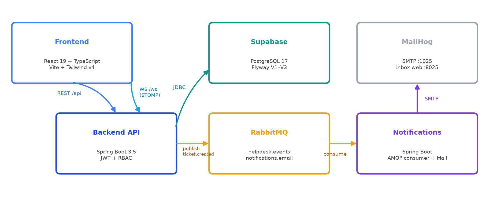
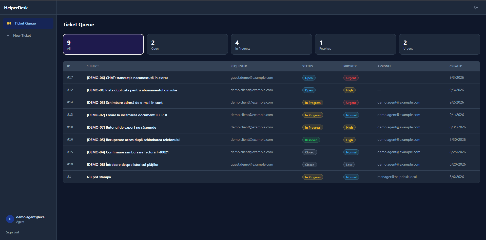

# HelperDesk-Analog

HelperDesk-Analog is a full-stack help desk application for managing customer support requests through two communication channels:

- **FORM tickets** for asynchronous support requests;
- **LIVE chat** for urgent issues that require real-time communication.

The project was developed during an internship at **LAZAR Software**. It covers the full development flow, from data modeling and backend implementation to frontend development, service integration, automated testing and CI.

> **Status:** Functional MVP. The application can be run locally with PostgreSQL/Supabase, RabbitMQ and MailHog.

## Contents

- [Features](#features)
- [Architecture](#architecture)
- [Tech stack](#tech-stack)
- [Screenshots and diagrams](#screenshots-and-diagrams)
- [Requirements](#requirements)
- [Configuration](#configuration)
- [Running the project](#running-the-project)
- [Roles](#roles)
- [Testing](#testing)
- [Project structure](#project-structure)
- [Roadmap](#roadmap)

## Features

### Clients

- register and log in;
- create FORM tickets through a support form;
- view their own tickets and conversation history;
- receive e-mail notifications;
- start a LIVE chat for urgent issues;
- exchange messages in real time through WebSocket/STOMP.

### Agents

- view the ticket queue;
- filter tickets by status and priority;
- receive new LIVE-ticket notifications in real time;
- assign and update tickets;
- reply to FORM tickets through the platform;
- reply to LIVE tickets through real-time chat.

### Managers

- use all agent capabilities;
- list users;
- create users;
- change user roles.

### Communication flows

**FORM — asynchronous support:**

```text
Client → REST API → PostgreSQL
                   ↓
                RabbitMQ → Notifications → SMTP/MailHog
```

**LIVE — real-time support:**

```text
Client ↔ WebSocket/STOMP ↔ Spring Boot API ↔ Agent
```

A FORM ticket remains a FORM ticket throughout its lifecycle. A LIVE ticket is created when the client sends the first chat message without an existing `ticketId`.

## Architecture

The application uses a **Spring Boot modular monolith** for the main API and a separate Notifications service for e-mail delivery.

```text
┌──────────────────────┐
│ React + TypeScript   │
│ Vite + Tailwind CSS  │
└──────────┬───────────┘
           │ REST / WebSocket-STOMP
           ▼
┌──────────────────────┐       ┌──────────────────────┐
│ Spring Boot API      │──────▶│ PostgreSQL / Supabase│
│ JWT + RBAC           │       │ Flyway migrations    │
└──────────┬───────────┘       └──────────────────────┘
           │ ticket.created / ticket.replied
           ▼
┌──────────────────────┐
│ RabbitMQ             │
└──────────┬───────────┘
           ▼
┌──────────────────────┐       ┌──────────────────────┐
│ Notifications        │──────▶│ SMTP / MailHog       │
│ Spring Boot + AMQP   │       └──────────────────────┘
└──────────────────────┘
```

The API publishes events after successful database operations. The Notifications service consumes those events and sends e-mails. Messages that cannot be processed after the configured retries are routed to a dead-letter queue.

## Tech stack

| Area | Technologies |
|---|---|
| Backend | Java 21, Spring Boot 3.5, Spring Web, Spring Data JPA, Hibernate |
| Security | Spring Security, JWT, BCrypt, role-based access control |
| Database | PostgreSQL, Supabase, Flyway |
| Messaging | RabbitMQ, Spring AMQP |
| Real-time communication | WebSocket, STOMP, `@stomp/stompjs` |
| Frontend | React 19, TypeScript, Vite, React Router |
| Styling | Tailwind CSS 4, CSS variables, light/dark mode |
| E-mail | Spring Mail, SMTP, MailHog |
| Testing | JUnit, Mockito, Testcontainers, Vitest, React Testing Library |
| DevOps | Docker Compose, Maven, npm, GitHub Actions |

## Screenshots and diagrams

The README uses project screenshots and a placeholder for the agent queue until a dedicated capture is available.

### Application architecture



### Login and registration


### Agent queue



### FORM ticket workflow


### LIVE chat


## Requirements

The following tools are required for local development:

- Java 21;
- Maven or the Maven Wrapper;
- Node.js 24 and npm;
- Docker Desktop with Docker Compose;
- an accessible PostgreSQL/Supabase database;
- Git.

Node.js 24 is the version used by the frontend GitHub Actions workflow. Docker is required for RabbitMQ and MailHog.

## Configuration

1. Clone the repository:

```bash
git clone https://github.com/aynez322/HelperDesk-Analog.git
cd HelperDesk-Analog
```

2. Create a root `.env` file from the example:

```bash
cp .env.example .env
```

On Windows, the same command can be run from Git Bash.

3. Fill in the database connection and JWT secret:

```env
DB_URL=jdbc:postgresql://<host>:5432/postgres
DB_USER=postgres
DB_PASSWORD=your-database-password
JWT_SECRET=a-random-secret-with-at-least-32-characters

RABBITMQ_HOST=localhost
RABBITMQ_PORT=5672
RABBITMQ_USER=helpdesk
RABBITMQ_PASSWORD=helpdesk

MAIL_HOST=localhost
MAIL_PORT=1025
MAIL_FROM=helpdesk@helpdesk.local
```

Do not commit `.env` to the repository.

## Running the project

### 1. Start local infrastructure

From the repository root:

```bash
docker compose up -d
```

Available services:

| Service | URL / port |
|---|---|
| RabbitMQ AMQP | `localhost:5672` |
| RabbitMQ Management UI | http://localhost:15672 |
| MailHog SMTP | `localhost:1025` |
| MailHog Web UI | http://localhost:8025 |

### 2. Start the backend API

```bash
cd backend/api
./mvnw spring-boot:run
```

On Windows, `mvnw.cmd spring-boot:run` can also be used.

The API runs on:

```text
http://localhost:8080
```

Health check:

```text
http://localhost:8080/api/health
```

### 3. Start the Notifications service

In a separate terminal:

```bash
cd notifications
mvn spring-boot:run
```

### 4. Start the frontend

In another terminal:

```bash
cd frontend
npm ci
npm run dev
```

The frontend is available at:

```text
http://localhost:5173
```

## Roles

New accounts created through the frontend receive the `CLIENT` role. Users can later be assigned the `AGENT` or `MANAGER` role through the administration flow.

| Role | Main permissions |
|---|---|
| CLIENT | Create and view own tickets; use FORM and LIVE support |
| AGENT | Manage the ticket queue and communicate with clients |
| MANAGER | Agent capabilities plus user administration |

## Testing

### Frontend

```bash
cd frontend
npm run lint
npm test
npm run build
```

### Backend

```bash
cd backend/api
./mvnw test
```

Integration tests use Testcontainers and a temporary PostgreSQL instance.

### Notifications

```bash
cd notifications
mvn test
```

### CI

The GitHub Actions workflow runs Maven tests for the backend and Notifications service, followed by frontend linting, tests and production build.

## Project structure

```text
HelperDesk-Analog/
├── backend/
│   └── api/                 # Spring Boot REST and WebSocket API
├── notifications/           # RabbitMQ consumer and e-mail service
├── frontend/                # React + TypeScript + Vite application
├── docs/
│   └── images/              # README screenshots and diagrams
├── docker-compose.yml       # RabbitMQ and MailHog
├── .env.example             # Configuration template without secrets
├── README.md                # Public project documentation
└── README.internal.md       # Detailed internal project documentation
```

## Roadmap

- deploy the services to a cloud environment;
- add centralized logging and observability;
- use the Outbox Pattern to guarantee event delivery;
- support anonymous LIVE-chat sessions;
- add file attachments to tickets;
- expand WebSocket and frontend end-to-end test coverage;
- improve production hardening, secret management and rate limiting.

## Internship context

HelperDesk-Analog was developed as an internship project at **LAZAR Software**. The work covered requirements analysis, database design, backend and frontend implementation, asynchronous messaging, real-time communication, testing and technical documentation.

## License

This project was developed for educational and internship purposes at LAZAR Software.
