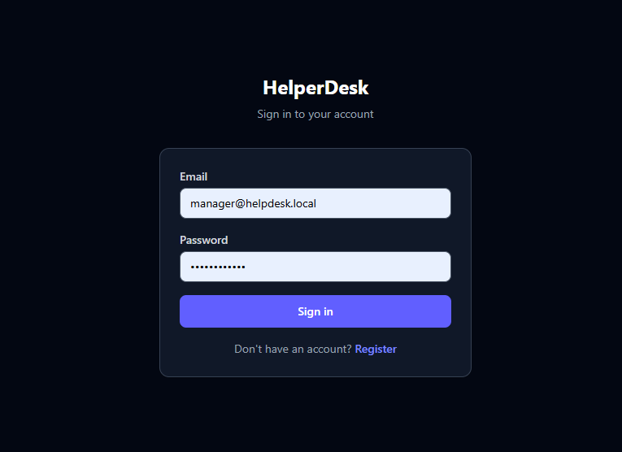
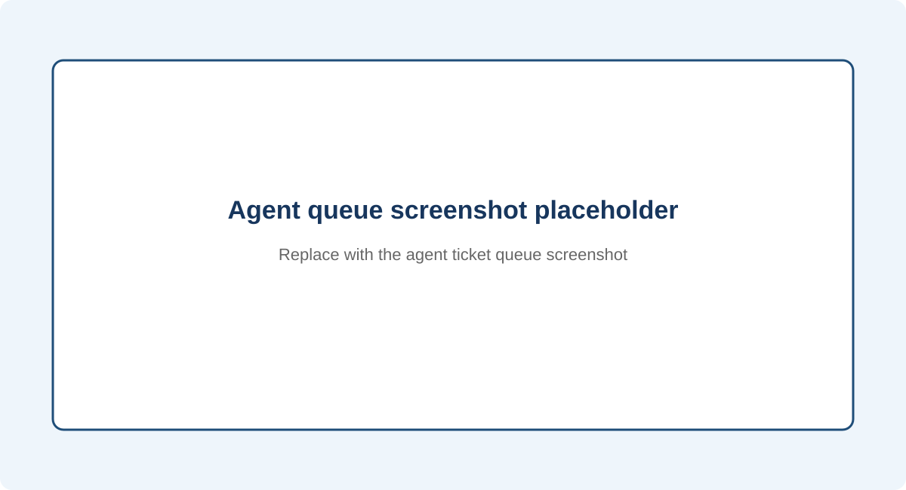
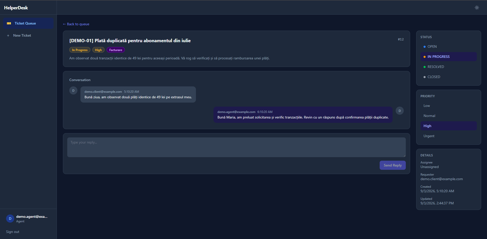
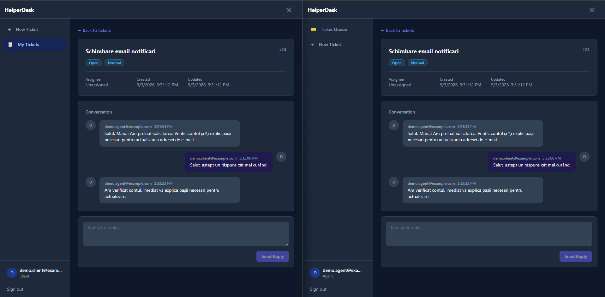

# HelperDesk-Analog

O aplicație full-stack de help desk pentru gestionarea solicitărilor de suport prin două canale: tichete asincrone create prin formular și chat live pentru situații urgente.

Proiectul a fost dezvoltat în cadrul stagiului de practică la **LAZAR Software** și acoperă întregul flux de dezvoltare: modelare, backend, frontend, comunicare între servicii, testare și CI.

> **Status:** MVP funcțional. Aplicația poate fi rulată local folosind PostgreSQL/Supabase, RabbitMQ și MailHog.

## Cuprins

- [Funcționalități](#funcționalități)
- [Arhitectură](#arhitectură)
- [Tech stack](#tech-stack)
- [Capturi și diagrame](#capturi-și-diagrame)
- [Cerințe](#cerințe)
- [Configurare](#configurare)
- [Pornirea proiectului](#pornirea-proiectului)
- [Conturi și roluri](#conturi-și-roluri)
- [Testare](#testare)
- [Structura proiectului](#structura-proiectului)
- [Roadmap](#roadmap)

## Funcționalități

### Pentru clienți

- înregistrare și autentificare;
- creare de tichete FORM prin formular;
- vizualizarea propriilor tichete și a istoricului conversației;
- primirea notificărilor prin e-mail;
- pornirea unui chat LIVE pentru probleme urgente;
- transmiterea mesajelor în timp real prin WebSocket/STOMP.

### Pentru agenți

- vizualizarea cozii de tichete;
- filtre după status și prioritate;
- primirea în timp real a tichetelor LIVE noi;
- asignarea și actualizarea tichetelor;
- răspunsuri prin conversație REST pentru FORM;
- răspunsuri prin chat live pentru LIVE.

### Pentru manageri

- toate operațiile disponibile agenților;
- listarea utilizatorilor;
- crearea utilizatorilor;
- schimbarea rolurilor.

### Fluxuri de comunicare

**FORM — asincron:**

```text
Client → REST API → PostgreSQL
                   ↓
                RabbitMQ → Notifications → SMTP/MailHog
```

**LIVE — în timp real:**

```text
Client ↔ WebSocket/STOMP ↔ Spring Boot API ↔ Agent
```

Un tichet FORM rămâne FORM. Un tichet LIVE este creat atunci când clientul trimite primul mesaj fără `ticketId`.

## Arhitectură

Aplicația este organizată ca un **modular monolith Spring Boot**, împreună cu un microserviciu separat pentru notificări.

```text
┌──────────────────────┐
│ React + TypeScript   │
│ Vite + Tailwind CSS  │
└──────────┬───────────┘
           │ REST / WebSocket-STOMP
           ▼
┌──────────────────────┐       ┌──────────────────────┐
│ Spring Boot API      │──────▶│ PostgreSQL / Supabase│
│ JWT + RBAC           │       │ Flyway migrations    │
└──────────┬───────────┘       └──────────────────────┘
           │ ticket.created / ticket.replied
           ▼
┌──────────────────────┐
│ RabbitMQ             │
└──────────┬───────────┘
           ▼
┌──────────────────────┐       ┌──────────────────────┐
│ Notifications        │──────▶│ SMTP / MailHog       │
│ Spring Boot + AMQP   │       └──────────────────────┘
└──────────────────────┘
```

Backend-ul publică evenimente după salvarea cu succes a datelor. Microserviciul Notifications consumă evenimentele și trimite e-mailuri. Mesajele care nu pot fi procesate după retry ajung în dead-letter queue.

## Tech stack

| Zonă | Tehnologii |
|---|---|
| Backend | Java 21, Spring Boot 3.5, Spring Web, Spring Data JPA, Hibernate |
| Securitate | Spring Security, JWT, BCrypt, RBAC |
| Bază de date | PostgreSQL, Supabase, Flyway |
| Mesagerie | RabbitMQ, Spring AMQP |
| Comunicare live | WebSocket, STOMP, `@stomp/stompjs` |
| Frontend | React 19, TypeScript, Vite, React Router |
| Stilizare | Tailwind CSS 4, CSS variables, light/dark mode |
| E-mail | Spring Mail, SMTP, MailHog |
| Testare | JUnit, Mockito, Testcontainers, Vitest, React Testing Library |
| DevOps | Docker Compose, Maven, npm, GitHub Actions |

## Capturi și diagrame

Imaginile de mai jos sunt placeholdere. Pot fi înlocuite cu capturi reale din aplicație, fără modificarea structurii README-ului.

### Arhitectura aplicației


### Login și înregistrare



### Coada agentului



### Formular FORM



### Chat LIVE



## Cerințe

Pentru rulare locală sunt necesare:

- Java 21;
- Maven sau Maven Wrapper;
- Node.js 24 și npm;
- Docker Desktop cu Docker Compose;
- un proiect PostgreSQL/Supabase accesibil prin JDBC;
- Git.

Node.js 24 este versiunea folosită de workflow-ul frontend din GitHub Actions. Docker este necesar pentru RabbitMQ și MailHog.

## Configurare

1. Clonează repository-ul:

```bash
git clone https://github.com/aynez322/HelperDesk-Analog.git
cd HelperDesk-Analog
```

2. Creează fișierul `.env` în rădăcina proiectului, pornind de la exemplu:

```bash
cp .env.example .env
```

Pe Windows Git Bash, aceeași comandă poate fi folosită din rădăcina proiectului.

3. Completează valorile pentru baza de date și secretul JWT:

```env
DB_URL=jdbc:postgresql://<host>:5432/postgres
DB_USER=postgres
DB_PASSWORD=parola-bazei-de-date
JWT_SECRET=un-secret-random-de-cel-putin-32-caractere

RABBITMQ_HOST=localhost
RABBITMQ_PORT=5672
RABBITMQ_USER=helpdesk
RABBITMQ_PASSWORD=helpdesk

MAIL_HOST=localhost
MAIL_PORT=1025
MAIL_FROM=helpdesk@helpdesk.local
```

Fișierul `.env` nu trebuie comis în repository.

## Pornirea proiectului

### 1. Pornește infrastructura locală

Din rădăcina proiectului:

```bash
docker compose up -d
```

Servicii disponibile:

| Serviciu | URL / port |
|---|---|
| RabbitMQ AMQP | `localhost:5672` |
| RabbitMQ Management UI | http://localhost:15672 |
| MailHog SMTP | `localhost:1025` |
| MailHog Web UI | http://localhost:8025 |

### 2. Pornește backend-ul API

```bash
cd backend/api
./mvnw spring-boot:run
```

Pe Windows, dacă este necesar, poți folosi și `mvnw.cmd spring-boot:run`.

API-ul pornește pe:

```text
http://localhost:8080
```

Health check:

```text
http://localhost:8080/api/health
```

### 3. Pornește microserviciul Notifications

Într-un terminal separat:

```bash
cd notifications
mvn spring-boot:run
```

Pe Windows, aceeași comandă poate fi rulată din Git Bash sau dintr-un terminal Maven configurat.

### 4. Pornește frontend-ul

Într-un alt terminal:

```bash
cd frontend
npm ci
npm run dev
```

Aplicația este disponibilă la:

```text
http://localhost:5173
```

## Conturi și roluri

Înregistrarea din interfață creează conturi cu rolul `CLIENT`. Pentru testare, un utilizator poate fi promovat la `AGENT` sau `MANAGER` prin mecanismul de administrare disponibil managerului.

| Rol | Permisiuni principale |
|---|---|
| CLIENT | Creează și urmărește propriile tichete, folosește FORM și LIVE chat |
| AGENT | Gestionează coada, tichetele și conversațiile cu clienții |
| MANAGER | Funcții de agent plus administrarea utilizatorilor |

## Testare

### Frontend

```bash
cd frontend
npm run lint
npm test
npm run build
```

### Backend

```bash
cd backend/api
./mvnw test
```

Testele de integrare folosesc Testcontainers și un PostgreSQL temporar.

### Notifications

```bash
cd notifications
mvn test
```

### CI

Workflow-ul GitHub Actions rulează testele Maven pentru backend și Notifications, apoi `lint`, `test` și `build` pentru frontend.

## Structura proiectului

```text
HelperDesk-Analog/
├── backend/
│   └── api/                 # Spring Boot API
├── notifications/           # Microserviciu RabbitMQ + e-mail
├── frontend/                # React + TypeScript + Vite
├── docs/
│   └── images/              # Capturi și diagrame pentru README
├── docker-compose.yml       # RabbitMQ și MailHog
├── .env.example             # Configurație fără secrete
├── README.md                # Documentația publică a proiectului
└── README.internal.md       # Documentație internă detaliată
```

## Roadmap

- deployment într-un mediu cloud;
- observabilitate și logging centralizat;
- Outbox Pattern pentru garantarea livrării evenimentelor;
- suport pentru pornirea unui chat LIVE de către utilizatori anonimi;
- atașamente pentru tichete;
- mai multe teste end-to-end pentru WebSocket și frontend;
- hardening pentru secrete, parole și rate limiting.

## Licență

Proiect realizat în scop educațional și de internship la LAZAR Software.
